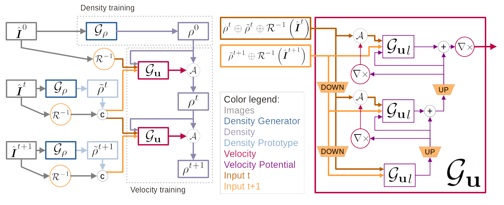
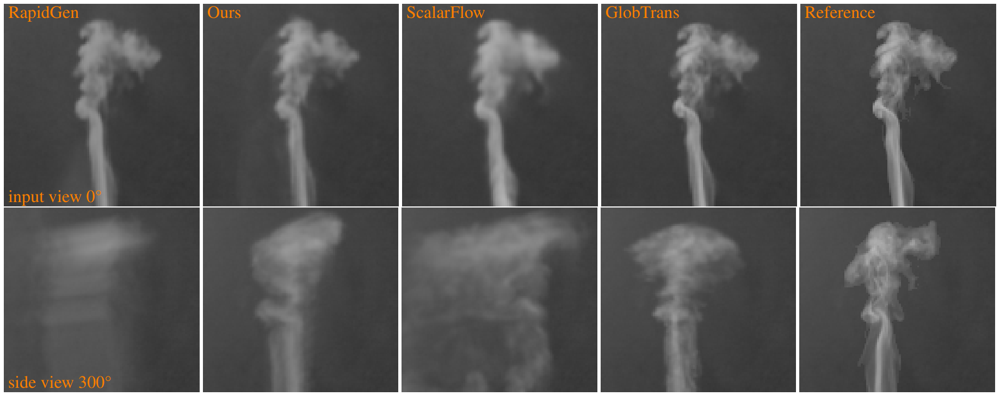

# Neural-Global-Transport
This repository contains the implementation of our ICLR 2023 paper [Learning to Estimate Single-View Volumetric Flow Motions without 3D Supervision](https://openreview.net/forum?id=2vmGv5wPDBZ)
([Project Website](https://ge.in.tum.de/publications/2023-franz-neuralglobtrans/), [arXiv](https://arxiv.org/abs/2302.14470))  
This work is based on our previous [Global Transport for Fluid Reconstruction with Learned Self-Supervision](https://openaccess.thecvf.com/content/CVPR2021/html/Franz_Global_Transport_for_Fluid_Reconstruction_With_Learned_Self-Supervision_CVPR_2021_paper.html) ([code](https://github.com/tum-pbs/Global-Flow-Transport))  

  
*Abstract*  
We address the challenging problem of jointly inferring the 3D flow and volumetric densities  moving in a fluid from a monocular input video with a deep neural network. Despite the complexity of this task, we show that it is possible to train the corresponding networks without requiring any 3D ground truth for training. In the absence of ground truth data we can train our model with observations from  real-world capture setups instead of relying on synthetic reconstructions. We make this unsupervised training approach possible by first generating an initial prototype volume which is then moved and transported over time without the need for volumetric supervision. Our approach relies purely on image-based losses, an adversarial discriminator network, and regularization. Our method can estimate long-term sequences in a stable manner, while achieving closely matching targets for inputs such as rising smoke plumes.

## Requirements

- A Linux system with a Cuda-capable GPU
- CUDA 9.2
- gcc/g++ <= 7.x (we used 5.5)
- Python 3.6, with packages:
	- numpy 1.17.2
	- Tensorflow-GPU v1.12
	- munch 2.5.0
	- imageio 2.6.0 (with its freeimage binary)
- We include parts of the [CUDA Samples](https://github.com/NVIDIA/cuda-samples)
- We include [OpenGL Mathematics](https://glm.g-truc.net/0.9.9/index.html) [v. 0.9.9.6](https://github.com/g-truc/glm/tree/0.9.9.6) (GLM), MIT license


## Installation

- Install Python and setup the environment via [conda](https://docs.conda.io/en/latest/miniconda.html):
	```
	conda create --name NGT --file NGT_env.txt
	```
	Don't forget to activate the environment:
	```
	conda activate NGT
	```
	(If you get errors regarding missing libraries, try restarting your shell session first.)
- Compile the rendering and advection kernels (requires `g++` and `nvcc` compilers, `nvcc` should come with the conda environment):
	```
	python compile.py
	```
	Alternatively, since the required gcc version is quite old, you can download the compiled kernels from the [releases](https://github.com/tum-pbs/Neural-Global-Transport/releases). Place them into `Neural-Global-Transport/phitest/render/cuda/build`.
- If the 'freeimage' binaries for imageio are not available on your system [download them from Github](https://github.com/imageio/imageio-binaries) OR run
	```
	imageio_download_bin freeimage
	```

## Data
Required training data are videos of moving smoke.
We use the captures of the [ScalarFlow dataset](https://ge.in.tum.de/publications/2019-scalarflow-eckert/) or renderings of a synthetic 3D smoke flow simulated with [Mantaflow](http://mantaflow.com/).
For the example setup you need the first 20 scenes of ScalarFlow in `Neural-Global-Transport/data/ScalarFlow/sim_*`.
Our final models trained for the ScalarFlow dataset can be found in the [releases](https://github.com/tum-pbs/Neural-Global-Transport/releases).
When using your own data, make sure that each frame (esp. the first frame) contains visible density.


## Training
The training procedure consists of training a single-frame Density Generator and then using this pre-trained network to train the Velocity Generator.
We provide example training setups for training with ScalarFlow data in './configs'. Other datasets might need adjusted hyperparameters.

- Train the Density Generator
	```
	python reconstruct_sequence.py --fit --device <GPU-device-id> --setup "configs/setup_density.json"
	```
- Choose the Density Generator to use. `<run-id>` is the 12 digit timestap of the Density Generator training run, e.g. `230501-164242`.  
	Update all mentions of `[RUNID:<run-id>]` in `configs/setup_velocity.json` with your `<run-id>`.
- Train the Velocity Generator
	```
	python reconstruct_sequence.py --fit --device <GPU-device-id> --setup "configs/train_velocity.json"
	```


## Inference
After training the model is evaluated only on a short validation sequence.  
To run a full length inference of our final model on the ScalarFlow data and render the results run:
```
python eval_runs.py -o "eval" --render --simulation 80 --frameRange 20 151 1 -d "runs/train_velDens_sequence" -n "NGT-final_SF80" --evalDataSetup SF --renderDensity --renderTarget -g 64 000000-000001 --device <GPU-device-id>
```
To save the generated volumes add the `--saveVol` flag.

## Example Results
  


## Citation
```
@InProceedings{Franz_2023_ICLR,
    author    = {Franz, Erik and Solenthaler, Barbara and Thuerey, Nils},
    title     = {Learning to Estimate Single-View Volumetric Flow Motions without 3D Supervision},
    booktitle = {},
    month     = {May},
    year      = {2023},
    pages     = {}
}
```

## Acknowledgements
This work was supported by the Siemens/IAS Fellowship Digital Twin, and the DFG Research Unit TH 2034/2-1.

